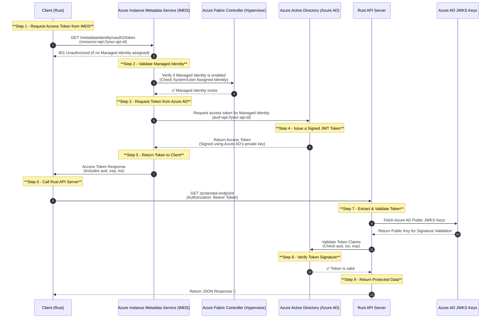

# managed-identity-concept

This repository contains a simple Rust API server that demonstrates how to authenticate requests using Azure Managed Identity. The API server is built using the [actix-web](https://actix.rs/) framework and uses the [jsonwebtoken](
I've developed this project to understand how Managed Identity works in Azure and how to authenticate requests using the access token provided by Azure AD and reduce the complexity of managing secrets and api key rotation in the application.



## Prerequisites

[Grant App Role to Managed Identity](https://learn.microsoft.com/en-us/graph/api/serviceprincipal-post-approleassignments?view=graph-rest-1.0&tabs=http#permissions)


Example powershell
```
$tenantId = '<your tenant id>'
$serverRoleId = '<your server role id (app role id)>'
$clientManagedIdentity = '<your client managed identity id (principal id)>'
$serverEnterpriseApp = '<your server enterprise app id (object id)>'

Connect-AzureAd -TenantId $tenantId

New-AzureADServiceAppRoleAssignment `
    -Id $serverRoleId `
    -PrincipalId $clientManagedIdentity `
    -ObjectId $clientManagedIdentity `
    -ResourceId $serverEnterpriseApp
```

$$clientManagedIdentity = '<your client managed identity id (principal id)>'


If you’re performing these operations programmatically using a service principal or managed identity, ensure that it has the necessary Microsoft Graph API application permissions granted and consented:
•	AppRoleAssignment.ReadWrite.All: Allows the app to read and write all application role assignments without a signed-in user.
•	Application.ReadWrite.All: Allows the app to read and write all applications and app registrations without a signed-in user.

These permissions are essential for creating and managing app role assignments via the Microsoft Graph API.  

Assigning Microsoft Graph API Permissions:

To assign these permissions to your application:
1.	Navigate to the Azure portal and select Azure Active Directory.
2.	Choose App registrations, and select your application.
3.	Go to API permissions and click on Add a permission.
4.	Select Microsoft Graph, then choose Application permissions.
5.	Search for and select the required permissions (e.g., AppRoleAssignment.ReadWrite.All and Application.ReadWrite.All).
6.	After adding the permissions, click on Grant admin consent to consent to the permissions for your organization.

Ensure that the account performing these actions has the necessary administrative privileges to grant these permissions.

By ensuring that the executing identity has the appropriate Azure AD role and Microsoft Graph API permissions, you should be able to successfully run the New-AzureADServiceAppRoleAssignment cmdlet.

