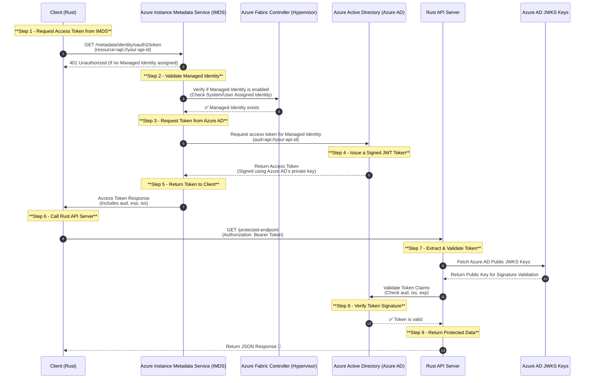

# managed-identity-concept
Reduce store API key and rotate key

```mermaid
sequenceDiagram
    autonumber

    participant Client as Client (Rust)
    participant IMDS as Azure Instance Metadata Service (IMDS)
    participant Hypervisor as Azure Fabric Controller (Hypervisor)
    participant AzureAD as Azure Active Directory (Azure AD)
    participant API as Rust API Server
    participant JWKS as Azure AD JWKS Keys

    Note over Client: **Step 1 - Request Access Token from IMDS**
    Client->>IMDS: GET /metadata/identity/oauth2/token <br> (resource=api://your-api-id)
    IMDS-->>Client: 401 Unauthorized (If no Managed Identity assigned)

    Note over IMDS: **Step 2 - Validate Managed Identity**
    IMDS->>Hypervisor: Verify if Managed Identity is enabled <br> (Check System/User Assigned Identity)
    Hypervisor-->>IMDS: ✅ Managed Identity exists

    Note over IMDS: **Step 3 - Request Token from Azure AD**
    IMDS->>AzureAD: Request access token for Managed Identity <br> (aud=api://your-api-id)
    
    Note over AzureAD: **Step 4 - Issue a Signed JWT Token**
    AzureAD-->>IMDS: Return Access Token <br> (Signed using Azure AD’s private key)

    Note over IMDS: **Step 5 - Return Token to Client**
    IMDS->>Client: Access Token Response <br> (Includes aud, exp, iss)

    Note over Client: **Step 6 - Call Rust API Server**
    Client->>API: GET /protected-endpoint <br> (Authorization: Bearer Token)

    Note over API: **Step 7 - Extract & Validate Token**
    API->>JWKS: Fetch Azure AD Public JWKS Keys
    JWKS-->>API: Return Public Key for Signature Validation
    API->>AzureAD: Validate Token Claims <br> (Check aud, iss, exp)

    Note over AzureAD: **Step 8 - Verify Token Signature**
    AzureAD-->>API: ✅ Token is valid

    Note over API: **Step 9 - Return Protected Data**
    API-->>Client: Return JSON Response 🎉
```