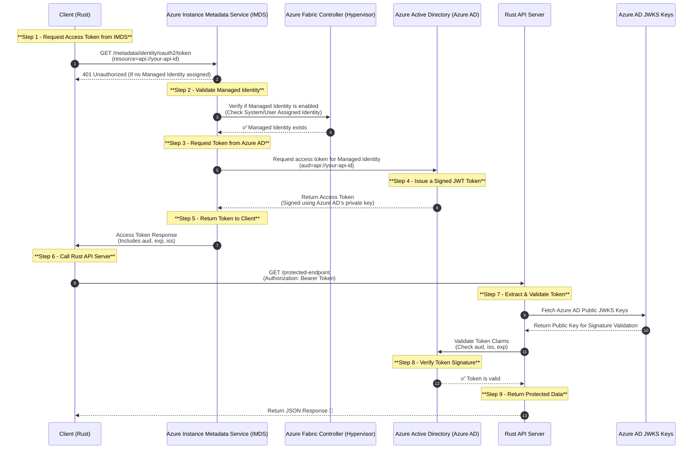

# managed-identity-concept

This repository contains a simple Rust API server that demonstrates how to authenticate requests using Azure Managed Identity. The API server is built using the [actix-web](https://actix.rs/) framework 
I've developed this project to understand how Managed Identity works in Azure and how to authenticate requests using the access token provided by Azure AD and reduce the complexity of managing secrets and api key rotation in the application.



## Prerequisites

[Grant App Role to Managed Identity](https://learn.microsoft.com/en-us/graph/api/serviceprincipal-post-approleassignments?view=graph-rest-1.0&tabs=http#permissions)


Example powershell
```
Import-Module Microsoft.Graph.Applications

$params = @{
	principalId = "9028d19c-26a9-4809-8e3f-20ff73e2d75e"
	resourceId = "8fce32da-1246-437b-99cd-76d1d4677bd5"
	appRoleId = "498476ce-e0fe-48b0-b801-37ba7e2685c6"
}

New-MgServicePrincipalAppRoleAssignment -ServicePrincipalId $servicePrincipalId -BodyParameter $params

```
Example rust code 
```rust
use reqwest::Client;
use serde_json::{json, Value};
use azure_identity::{DefaultAzureCredential, TokenCredentialOptions};
use azure_core::auth::TokenCredential;
use log::{debug, error, info};
use std::error::Error;

#[tokio::main]
async fn main() -> Result<(), Box<dyn Error>> {
    pretty_env_logger::init();
    dotenv::dotenv().ok();

    // Initialize the HTTP client
    let client = Client::new();

    // Obtain an access token
    let credential = DefaultAzureCredential::create(TokenCredentialOptions::default())?;
    let token = credential
        .get_token(&["https://graph.microsoft.com/.default"])
        .await?;

    debug!("Access token: {:?}", token.token.secret());

    // Define the client ID of your application (example is rust-api-aad)
    let client_id = std::env::var("AZURE_CLIENT_ID")?;
    // Define the appId of your application
    let app_id = client_id;

    // Retrieve the service principal's ID
    let sp_response = client
        .get(&format!(
            "https://graph.microsoft.com/v1.0/servicePrincipals?$filter=appId eq '{}'",
            app_id
        ))
        .bearer_auth(token.token.secret())
        .send()
        .await?;

    if sp_response.status().is_success() {
        let sp_json: Value = sp_response.json().await?;
        debug!("Service Principal: {:#?}", sp_json);

        if let Some(sp_id) = sp_json["value"][0]["id"].as_str() {
            info!("Service Principal ID: {}", sp_id);

            // Define the app role assignment
            let app_role_assignment = json!({
                "principalId": "bade3fcb-212d-47fc-9305-bec2cccd22ed",
                "resourceId": "e0d8073f-7a4d-4797-96f1-a2b7368974d5",
                "appRoleId": "b8424875-7729-478e-ab73-a3e60fad79fd"
            });

            // Send the HTTP request to assign the app role
            let response = client
                .post(&format!(
                    "https://graph.microsoft.com/v1.0/servicePrincipals/{}/appRoleAssignments",
                    sp_id
                ))
                .bearer_auth(token.token.secret())
                .json(&app_role_assignment)
                .send()
                .await?;

            // Check the response
            if response.status().is_success() {
                info!("App role assigned successfully.");
            } else {
                error!(
                    "Failed to assign app role: {:#?}",
                    response.json::<Value>().await?
                );
            }
        } else {
            error!("Service Principal not found for appId: {}", app_id);
        }
    } else {
        error!(
            "Failed to retrieve service principal: {:#?}",
            sp_response.json::<Value>().await?
        );
    }

    Ok(())
}

```

#principalId = "<your client managed identity id (principal id)>"


#resourceId = "<your api app id>"


#appRoleId = "<your app role id>"


If you’re performing these operations programmatically using a service principal or managed identity, ensure that it has the necessary Microsoft Graph API application permissions granted and consented:
•	AppRoleAssignment.ReadWrite.All: Allows the app to read and write all application role assignments without a signed-in user.
•	Application.ReadWrite.All: Allows the app to read and write all applications and app registrations without a signed-in user.

These permissions are essential for creating and managing app role assignments via the Microsoft Graph API.  

Assigning Microsoft Graph API Permissions:

To assign these permissions to your application:
1.	Navigate to the Azure portal and select Azure Active Directory.
2.	Choose App registrations, and select your application.
3.	Go to API permissions and click on Add a permission.
4.	Select Microsoft Graph, then choose Application permissions.
5.	Search for and select the required permissions (e.g., AppRoleAssignment.ReadWrite.All and Application.ReadWrite.All).
6.	After adding the permissions, click on Grant admin consent to consent to the permissions for your organization.

Ensure that the account performing these actions has the necessary administrative privileges to grant these permissions.

By ensuring that the executing identity has the appropriate Azure AD role and Microsoft Graph API permissions, you should be able to successfully run the New-AzureADServiceAppRoleAssignment cmdlet.

